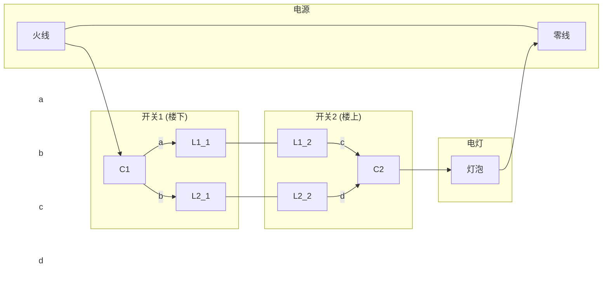

### 4.3
在稳恒电流条件下，导体内电流$I$是恒定的，因此电流密度$J=I/A$在两段导体中也是相同的，其中$A=\pi a^2$是导体的横截面积。根据微观欧姆定律$\vec{J}=\sigma \vec{E}$，两段导体内的电场强度分别为
$$
E_1 = \frac{J}{\sigma_1} = \frac{I}{\pi a^2 \sigma_1} \quad \text{和} \quad E_2 = \frac{J}{\sigma_2} = \frac{I}{\pi a^2 \sigma_2}
$$
由于$\sigma_1 \neq \sigma_2$，所以在两导体的交界面处，电场强度发生了突变。根据高斯定理，电场法向分量的突变意味着界面上存在面电荷。我们在交界面处取一个极薄的圆柱形高斯面，其底面面积为$A=\pi a^2$，一个底面在导体1中，另一个在导体2中。通过该高斯面的电通量为
$$
\Phi_E = \oint \vec{E} \cdot d\vec{S} = (E_2 - E_1)A
$$
根据高斯定理$\Phi_E = Q/\epsilon_0$，其中$Q$是界面上的总电荷。联立以上各式可得
$$
Q = \epsilon_0 (E_2 - E_1)A = \epsilon_0 \left( \frac{I}{\pi a^2 \sigma_2} - \frac{I}{\pi a^2 \sigma_1} \right) (\pi a^2)
$$
化简后得到界面上的总电荷为
$$
Q = \epsilon_0 I \left(\frac{1}{\sigma_2} - \frac{1}{\sigma_1}\right)
$$

### 4.6
此问题可看作计算一个同轴圆柱形电阻的阻值，然后用欧姆定律求电流。电流从内层电缆径向流出，通过橡胶层到达外层的海水。橡胶层的电阻是我们要计算的。
电缆的半径为$a = 5.00 \text{ mm} / 2 = 2.5 \text{ mm} = 2.5 \times 10^{-3} \text{ m}$。
橡胶层的外半径为$b = a + \text{厚度} = 2.5 \text{ mm} + 10.0 \text{ mm} = 12.5 \text{ mm} = 12.5 \times 10^{-3} \text{ m}$。
电缆长度$L = 3000 \text{ km} = 3 \times 10^6 \text{ m}$。
橡胶的电阻率$\rho = 1.00 \times 10^{15} \, \Omega \cdot \text{m}$。

对于径向电流，同轴圆柱形电阻的计算公式为
$$
R = \frac{\rho}{2\pi L} \ln\left(\frac{b}{a}\right)
$$
将数值代入计算橡胶层的总电阻：
$$
\begin{align}
R &= \frac{1.00 \times 10^{15} \, \Omega \cdot \text{m}}{2\pi (3 \times 10^6 \text{ m})} \ln\left(\frac{12.5 \times 10^{-3}}{2.5 \times 10^{-3}}\right) \\
&= \frac{1.00 \times 10^{15}}{6\pi \times 10^6} \ln(5) \, \Omega \\
&\approx 8.54 \times 10^7 \, \Omega
\end{align}
$$
根据欧姆定律，通过橡胶层的泄漏电流为
$$
I = \frac{U}{R} = \frac{100 \text{ V}}{8.54 \times 10^7 \, \Omega} \approx 1.17 \times 10^{-6} \text{ A}
$$

### 4.8
首先，计算由$n=5$个电池串联而成的电池组的总电动势$\mathcal{E}_{tot}$和总内阻$r_{tot}$。
$$
\mathcal{E}_{tot} = n\mathcal{E} = 5 \times 1.4\,\text{V} = 7.0\,\text{V}
$$
$$
r_{tot} = nr = 5 \times 0.30\,\Omega = 1.5\,\Omega
$$
电池组的有用功率（即输出功率）$P_{out}$是总功率减去内阻消耗的功率，其表达式为
$$
P_{out} = \mathcal{E}_{tot}I - I^2r_{tot}
$$
其中$I$是电路中的电流。

(1) 求解有用功率为$8.0\text{W}$时的电流。
我们将$P_{out}=8.0\text{W}$代入上式，得到一个关于电流$I$的二次方程：
$$
8.0 = 7.0I - 1.5I^2
$$
这得到两个解：
$$
I_1 = \frac{7.0 + 1.0}{3.0} = \frac{8.0}{3.0} \approx 2.67\,\text{A}
$$
$$
I_2 = \frac{7.0 - 1.0}{3.0} = \frac{6.0}{3.0} = 2.0\,\text{A}
$$
因此，当电流为$2.67\text{A}$或$2.0\text{A}$时，电池组的有用功率均为$8.0\text{W}$。

(2) 求解电池组的最大有用功率。
为了求功率$P_{out}(I)$的极值，我们对其求导并令导数为零：
$$
\frac{dP_{out}}{dI} = \frac{d}{dI}(7.0I - 1.5I^2) = 7.0 - 3.0I = 0
$$
解得实现最大功率的电流为
$$
I_{maxP} = \frac{7.0}{3.0} \approx 2.33\,\text{A}
$$
将此电流值代回功率表达式，得到最大有用功率：
$$
P_{max} = 7.0\left(\frac{7.0}{3.0}\right) - 1.5\left(\frac{7.0}{3.0}\right)^2 = \frac{49}{3} - 1.5\left(\frac{49}{9}\right) = \frac{49}{3} - \frac{49}{6} = \frac{49}{6} \approx 8.17\,\text{W}
$$
根据最大功率传输定理，当外电路电阻等于电源内阻时，输出功率最大。此时$P_{max} = \frac{\mathcal{E}_{tot}^2}{4r_{tot}} = \frac{(7.0)^2}{4(1.5)} = \frac{49}{6} \approx 8.17\,\text{W}$。

### 4.14
将$n$个电池排成$p$列相并联，每一列中有$s$个电池相串联，则电池总数$n=ps$。
对于每一列（支路），其总电动势为$s\mathcal{E}$，总内阻为$sr$。
将$p$个这样的支路并联，构成的电源组的总电动势等于任一支路的电动势，即$\mathcal{E}_{总} = s\mathcal{E}$。
电源组的总内阻$r_{总}$是$p$个阻值为$sr$的电阻并联的结果：
$$
\frac{1}{r_{总}} = \sum_{i=1}^{p} \frac{1}{sr} = \frac{p}{sr} \implies r_{总} = \frac{sr}{p}
$$
根据最大功率传输定理，当外电路电阻$R$等于电源内阻$r_{总}$时，外电路获得的输出功率最大。因此，我们令
$$
R = r_{总} = \frac{sr}{p}
$$
由此可得$pR=sr$。现在我们利用$n=ps$这一关系来分别求解$s$和$p$。
将$p=n/s$代入$pR=sr$中：
$$
\frac{n}{s}R = sr \implies nR = s^2r \implies s^2 = \frac{nR}{r}
$$
解得$s = \sqrt{\frac{nR}{r}}$。由于$s$必须为整数，所以当$s \approx \sqrt{\frac{nR}{r}}$时，输出功率最大。

同样地，将$s=n/p$代入$pR=sr$中：
$$
pR = \frac{n}{p}r \implies p^2R = nr \implies p^2 = \frac{nr}{R}
$$
解得$p = \sqrt{\frac{nr}{R}}$。由于$p$必须为整数，所以当$p \approx \sqrt{\frac{nr}{R}}$时，输出功率最大。
证毕。

### 4.31
(1) 证明电荷依指数规律漏失。
一个填充了不理想介质的平行板电容器，可以等效为一个理想电容器$C$与一个纯电阻$R$并联的电路。设极板面积为$A$，间距为$d$，则其电容和电阻分别为：
$$
C = \frac{\epsilon_0 \epsilon_r A}{d} = \frac{\epsilon A}{d}
$$
$$
R = \rho \frac{d}{A} = \frac{1}{\sigma} \frac{d}{A}
$$
当电容器充电至$Q$后撤去电源，它将通过自身的等效电阻$R$放电。根据回路方程，电容器两端的电压$U=Q/C$等于电阻两端的电压$IR$。放电电流$I = -\frac{dQ}{dt}$（负号表示电荷减少）。
$$
\frac{Q}{C} = I R = \left(-\frac{dQ}{dt}\right)R
$$
整理得微分方程：
$$
\frac{dQ}{dt} = -\frac{1}{RC}Q
$$
这是一个一阶线性微分方程，其解为$Q(t) = Q_0 e^{-t/\tau}$，其中$Q_0$是初始电荷，$t=0$时为$Q$。时间常数$\tau = RC$。
$$
\tau = RC = \left(\frac{d}{\sigma A}\right) \left(\frac{\epsilon A}{d}\right) = \frac{\epsilon}{\sigma}
$$
因此，电荷$Q(t) = Q e^{-t\sigma/\epsilon}$，表明电荷随时间依指数规律漏失。

(2) 证明产生的焦耳热总量等于电容器中原来所贮的电能。
电容器中原来储存的电能为
$$
U_E = \frac{Q^2}{2C}
$$
在放电过程中，电流为$I(t) = -\frac{dQ}{dt} = \frac{Q}{RC}e^{-t/RC}$。电阻$R$上消耗的瞬时功率为$P(t) = I(t)^2 R$。产生的总焦耳热$W$是功率对时间从$0$到$\infty$的积分。
$$
\begin{align}
W &= \int_0^\infty P(t) dt = \int_0^\infty I(t)^2 R dt \\
&= \int_0^\infty \left(\frac{Q}{RC}e^{-t/RC}\right)^2 R dt \\
&= \frac{Q^2 R}{R^2 C^2} \int_0^\infty e^{-2t/RC} dt \\
&= \frac{Q^2}{RC^2} \left[ -\frac{RC}{2} e^{-2t/RC} \right]_0^\infty \\
&= \frac{Q^2}{RC^2} \left( 0 - \left(-\frac{RC}{2}\right) \right) \\
&= \frac{Q^2}{2C}
\end{align}
$$
可见，产生的总焦耳热$W$等于电容器初始储存的电能$U_E$。证毕。

### 【例4.1.2】
将导线看作是由许多无限薄的圆片串联而成。在距离一端$x$处，取一个厚度为$dx$的薄片，其电阻为$dR$。由于这个薄片很薄，可以认为其截面积$A(x)$和电导率$\sigma(x)$是恒定的。根据电阻公式，这个薄片的电阻为$dR = \rho(x) \frac{dx}{A(x)}$，其中电阻率$\rho(x) = 1/\sigma(x)$。整个导线的总电阻$R$是所有这些薄片电阻的串联总和，因此可以通过对$dR$从导线的一端（$x=0$）到另一端（$x=L$）积分得到。
$$
R = \int_0^L dR = \int_0^L \frac{1}{\sigma(x)} \frac{dx}{A(x)}
$$

### 【例4.1.3】
这是一个同轴圆柱形电阻，电流从内电极（半径为$a$）径向流向外电极（内径为$b$）。为了计算其电阻，我们同样采用积分法。考虑一个半径为$r$、厚度为$dr$、长度为$L$的薄圆柱壳。电流径向穿过这个薄壳，所以电流流过的面积是该壳的侧面积$A=2\pi r L$。电流穿过的距离是壳的厚度$dr$。因此，这个薄壳的电阻$dR$为：
$$
dR = \rho \frac{dr}{A} = \rho \frac{dr}{2\pi r L}
$$
整个圆柱形电阻可以看作是无数个这样的薄壳串联而成。总电阻$R$就是将$dR$从内半径$a$积分到外半径$b$。
$$
R = \int_a^b dR = \int_a^b \frac{\rho}{2\pi L} \frac{dr}{r} = \frac{\rho}{2\pi L} [\ln r]_a^b
$$
计算可得最终的电阻表达式：
$$
R = \frac{\rho}{2\pi L} (\ln b - \ln a) = \frac{\rho}{2\pi L} \ln\left(\frac{b}{a}\right)
$$

### 【例4.2.1】

该电路的示意图：

*   **说明**：开关1的公共端`C1`连接火线。开关1可以在`L1_1`和`L2_1`之间切换。开关2的公共端`C2`连接灯泡。开关2可以在`L1_2`和`L2_2`之间切换。`L1_1`与`L1_2`相连，`L2_1`与`L2_2`相连。当两个开关同时接通上面的线路（`L1_1`和`L1_2`）或同时接通下面的线路（`L2_1`和`L2_2`）时，电路导通，灯亮。否则灯灭。
### 平行板电容器

设平行板电容器的极板面积为$S$，板间距离为$d$。当其中充满电容率为$\varepsilon$的介质时，其电容为：
$$
C = \frac{\varepsilon S}{d}
$$
当介质的电阻率为$\rho$时，两极板间的电阻为：
$$
R = \rho \frac{d}{S}
$$
将两者相乘，得到时间常数$\tau = RC$：
$$
RC = \left(\rho \frac{d}{S}\right) \left(\frac{\varepsilon S}{d}\right) = \rho\varepsilon
$$
该结果只与介质的材料性质（电阻率$\rho$和电容率$\varepsilon$）有关，与电容器的尺寸（面积$S$和距离$d$）无关。因此，其放电动力学行为与电容器尺寸无关。

### 对于同轴圆筒电容器（丹尼尔电池模型）

对于长度为$l$，内半径为$a$，外半径为$b$的同轴圆筒，其间的电解液电阻可以看作是无数个薄圆筒壳电阻的串联。半径为$r$、厚度为$dr$的薄圆筒壳的电阻为$dR = \rho \frac{dr}{2\pi r l}$。积分可得总电阻$R$：
$$
R = \int_a^b \rho \frac{dr}{2\pi r l} = \frac{\rho}{2\pi l} \ln\left(\frac{b}{a}\right)
$$
该同轴圆筒的电容$C$为：
$$
C = \frac{2\pi\varepsilon l}{\ln(b/a)}
$$
将$R$与$C$相乘，得到它们之间的关系：
$$
RC = \left(\frac{\rho}{2\pi l} \ln\left(\frac{b}{a}\right)\right) \left(\frac{2\pi\varepsilon l}{\ln(b/a)}\right) = \rho\varepsilon
$$
可见，对于同轴圆筒结构，$R$与$C$的关系同样为$RC = \rho\varepsilon$。

